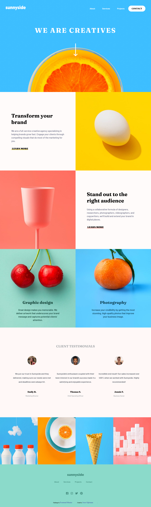

# Frontend Mentor - Sunnyside agency landing page solution

This is a solution to the [Sunnyside agency landing page challenge on Frontend Mentor](https://www.frontendmentor.io/challenges/sunnyside-agency-landing-page-7yVs3B6ef). Frontend Mentor challenges help you improve your coding skills by building realistic projects.

## Table of contents

- [Overview](#overview)
  - [The challenge](#the-challenge)
  - [Screenshot](#screenshot)
  - [Links](#links)
- [My process](#my-process)
  - [Built with](#built-with)
  - [What I learned](#what-i-learned)
  - [Continued development](#continued-development)
  - [Useful resources](#useful-resources)
- [Author](#author)


**Note: Delete this note and update the table of contents based on what sections you keep.**

## Overview

### The challenge

Users should be able to:

- View the optimal layout for the site depending on their device's screen size
- See hover states for all interactive elements on the page

### Screenshot




### Links

- Solution URL: [https://github.com/JesseOlisa/sunnyside-agency-landing-page-main]
- Live Site URL: [https://jesseolisa.github.io/sunnyside-agency-landing-page-main/]

## My process

I started with the desktop version first. Then did the mobile version last.


### Built with

- Semantic HTML5 markup
- CSS custom properties
- Flexbox
- CSS Grid
- Javascript


### What I learned

The major highlight of the things i learnt how to do was adding that triangle at the mobile version nav bar. i have never done that before. 

Secondly, the line beneath the learn more. I was quite produce of myself i did it.

```css
.learn-link-1 {
    position: relative;
    width: 150px;
}
.learn-link-1::before {
    position: absolute;
    content: "";
    bottom: 0;
    left: 0;
    width: 100%;
    height: 8px;
    background-color: hsla(51, 100%, 49%, 0.5);
    border-radius: 10px;
    z-index: -1;
}
.learn-link-1:hover::before {
    background-color: hsl(51, 100%, 49%);
    transition: 0.5s;
}
```

Although, i feel there are better ways i could have done some of these css designs. So, feedbacks are very much welcome.


### Continued development

I look forward to continue develop my css skills and slowly move into javascript. 
I recently discovered that websites without javascripts are no fun :-)

### Useful resources

- To be honest, the internet helped alot. 

## Author

- Frontend Mentor - [https://www.frontendmentor.io/profile/JesseOlisa]
- Twitter - [https://www.twitter.com/yourusername/jesseOlisa]

